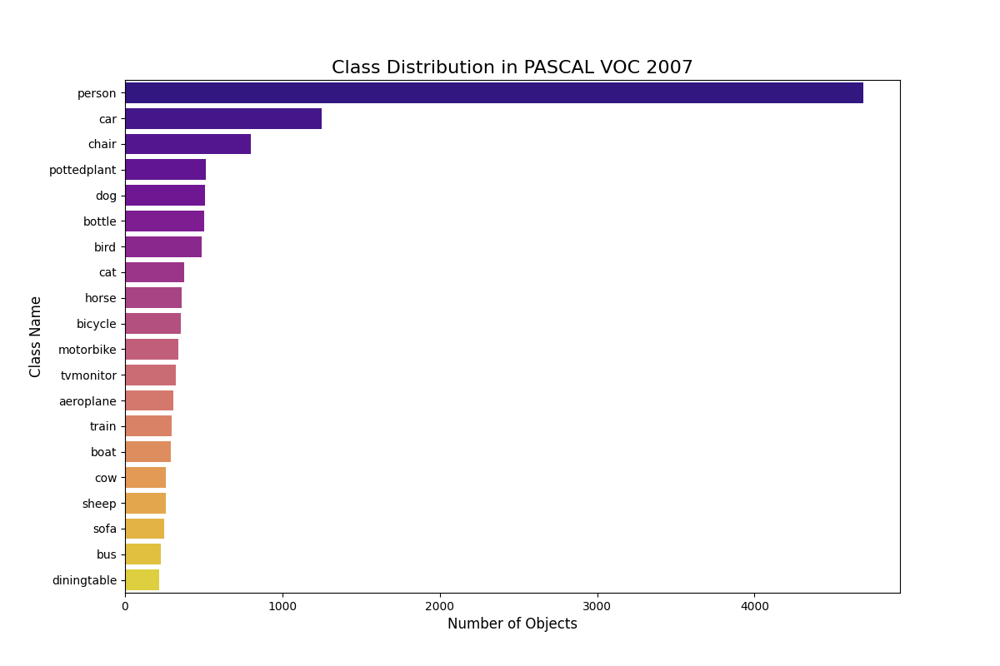

<h1 align="center">YOLOv3 on PASCAL VOC 2007</h1>

This project trains a **YOLOv3 object detection model** on the **PASCAL VOC 2007** dataset.
Before training, the dataset is **carefully analyzed and preprocessed** to ensure data quality and compatibility with the YOLO format.

---

## Project Overview

* **Model**: YOLOv3
* **Dataset**: PASCAL VOC 2007 (Dataset link (Kaggle mirror): ➡ [https://www.kaggle.com/datasets/stpeteishii/pascal-voc-2007-dataset](https://www.kaggle.com/datasets/stpeteishii/pascal-voc-2007-dataset))
* **Task**: Object Detection

The workflow consists of:

1. **Dataset Analysis**
2. **Dataset Preprocessing**
3. **Model Training**

---

## Dataset Analysis

Before training, an exploratory analysis is performed on the VOC 2007 dataset, including:

### Class Distribution

* Computation and visualization of class frequencies
* Identification of class imbalance



### Image Size Statistics

* Analysis of image width and height
* Distribution plots for image dimensions

### Missing Values

* Validation of annotations and bounding boxes
* Detection of missing or malformed entries

### Bounding Box Statistics

* Analysis of bounding box width, height, and area
* Distribution of bounding box sizes across the dataset

These steps help understand dataset characteristics and guide preprocessing decisions.

---

## Data Preprocessing

During preprocessing:

* The dataset is **converted to YOLO format**
* Objects with:

  * `difficult == 1` **or higher**

  are **ignored** and excluded from training
* Normalized bounding boxes are generated in YOLO format:

  ```
  class_id x_center y_center width height
  ```

This ensures compatibility with YOLOv3 and improves training stability.

---

## Model Training

* YOLOv3 is trained using the preprocessed VOC 2007 dataset
* Final dataset structure follows YOLO-style annotations
* Training focuses on clean, filtered annotations only
